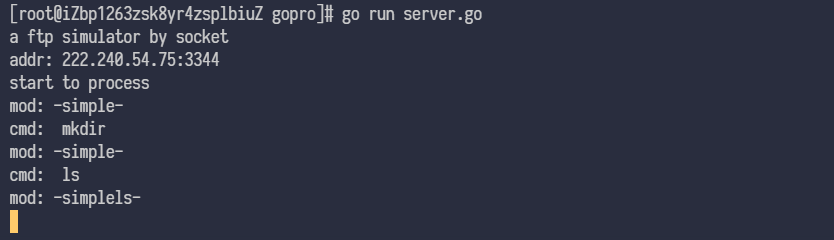

一个go 语言实现的ftp模拟器. 实现常见的终端命令, 和文件的上传, 下载.

## TODO
- [x] 文件上传功能
- [x] 终端交互
- [ ] 基本命令
    - [ ] upload
    - [ ] download
    - [ ] 终端通用命令
- [ ] 下载文件
- [ ] 下载文件夹 
- [ ] 进度条, 下载速度
- [ ] 登陆验证
- [ ] web版可视化操作


## 问题

1. 粘包问题

使用阿里云的服务器做server的时候, 遇到了一种非常奇怪的现象: 两个client发送的数据在server上被一个Read读取了. 在本地没有这样. 查阅资料后, 突然意识到这可能是之前见过的名词: **粘包**. 

如下图, simple 和 ls 本应该是分开的, 但第二个连载了一起, 造成程序堵塞了. 



但是看了下面这篇知乎文章, 据说根本没有粘包这一学术名词. 

>  https://www.zhihu.com/question/20210025

之所以我这里会出现粘包, 是因为我发送的数据不规格. 应该按照指定的字节长度收发.

有个人是这么说的

> TCP粘包是用 TCP写协议的人连 TCP是字节流协议都没搞明白就胡写产生的一种低级错误

虽然听上去很傲慢但确实是这个道理


2. 字符串字符判断相等问题

为什么总是判断相等不成功? 好像是编码原因?


3. cd 无法切换工作目录, 工作目录始终是当前目录, 这个就尴尬了. ok, 使用`os.Chdir`解决了


4. 有一个问题, 开多个客户端时, 虽然可以并发处理, 但是他们对应的服务器端的当前工作目录是同一个目录. .. 这个客户端切换后, 另一个也会切换. 

    虽然这个项目的功能更倾向于一对一, 很少会出现一对多的情况, 但是这还是个问题啊


5. 遇到一个问题, 用其他的string创建文件可以, 但用socket传递过来的byte转化成的string就不可以. 同样判断是否相等也是, 应该是同一个问题.


6. 发现写入文件的时候会多写入一些东西

    ```
    [root@iZbp1263zsk8yr4zsplbiuZ gopro]# go run loop.go
    # command-line-arguments
    ./loop.go:51:1: invalid NUL character
    ```

    比如上传的 loop.go 就不能运行, 有损坏

    检查后发现最后一行多写入了很多东西

    


7. 发现这个传输和自己想象的有点不一样

    比如我传输一个字符串, 然后后面填空的 byte, 以为这个传输的n是字符串的长度, 但其实是完整的1024, 所以我比较字符串的时候, 是和真实的字符串不一样的. 还有传递文件的时候, 在后面会多传输很多的字节. 

    

    难道要自己去设计协议? 在信息的头部指定长度, 然后读取这个长度? 有没有什么办法可以直接截取到我传输的字符串. 

    是了, 我把字符串的尾部删除了, 然后就成功地创建了文件. 但是文件也要这样吗? 有没有更好的方式?

    现在觉得协议是很重要的规范, 比如我可以定义一个文件上传协议, 包含以下字段

    \[模式]\[文件名]\[文件大小]\[文件内容]

    规定前面的内容的长度, 最后文件内容是不规定长度的.